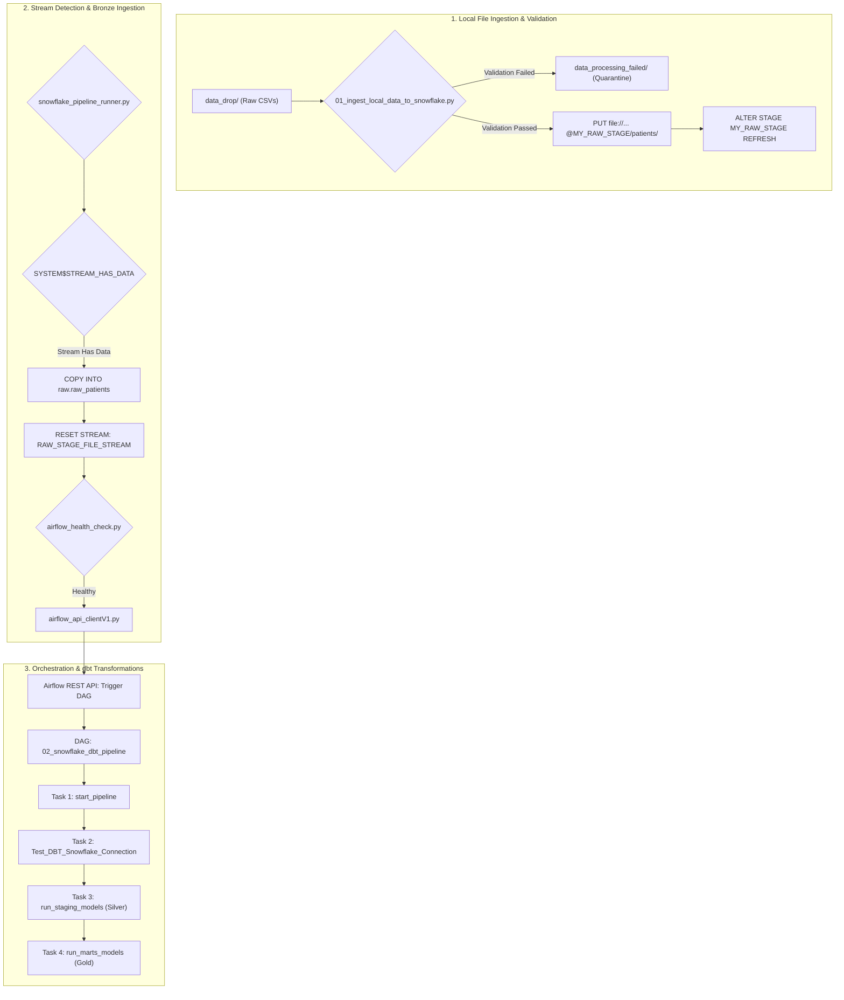

## 🏗️ Architecture & Data Flow


## 🏗️ Architecture Overview

1. **Local File Validation & Staging (`scripts/01_ingest_local_data_to_snowflake.py`)**:
   * Scans the local drop directory (`data_drop/`) for inbound raw patient CSV files.
   * Performs schema, non-empty, and filename pattern validations (`patient_id`, `first_name`, `last_name`, `gender`, `dob`).
   * Routes invalid or malformed files to `data_processing_failed/`.
   * Uploads valid files directly to the Snowflake Internal Stage (`@MY_RAW_STAGE/patients/`) via `PUT`.

2. **Event-Driven Orchestration Trigger (`scripts/snowflake_pipeline_runner.py`)**:
   * Refreshes the Snowflake stage directory and evaluates `SYSTEM$STREAM_HAS_DATA` on the Directory Stream (`RAW_STAGE_FILE_STREAM`).
   * Executes a `COPY INTO` operation to load stage data into the Bronze (`RAW`) table (`healthcare_analytics.raw.raw_patients`).
   * Resets the stream consumption offset (`CREATE OR REPLACE STREAM RAW_STAGE_FILE_STREAM`).
   * Verifies Airflow cluster health via `scripts/airflow_health_check.py`.
   * Authenticates via `scripts/airflow_api_clientV1.py` and dynamically triggers the downstream Airflow DAG (`02_snowflake_dbt_pipeline`).

3. **Orchestration & Transformation (`dags/dbt_snowflake_pipeline.py` & dbt)**:
   * Airflow DAG runs `dbt debug` connection checks to verify Snowflake connectivity.
   * Executes `dbt build --select staging` (**Silver Layer**: Cleaning, Type Casting, Deduplication).
   * Executes `dbt build --select marts` (**Gold Layer**: Dimensional & Fact Modeling).
   
---

## 📂 Project Structure

```text
├── config/
├── dags/                             # Airflow DAGs folder
│   ├── dbt_snowflake_pipeline.py     # Primary Airflow DAG orchestration script
│   ├── hello_world_dag.py            # Test DAG
│   └── dbt_project/                  # dbt Project root
│       ├── macros/
│       ├── models/
│       │   ├── raw/
│       │   ├── staging/              # Silver layer dbt models
│       │   └── marts/                # Gold layer dbt models
│       ├── dbt_project.yml           # dbt project configuration
│       └── profiles.yml              # dbt connection target profile
├── data_drop/                        # Landing folder for incoming raw CSVs
├── data_processing_failed/           # Quarantine folder for malformed files
├── scripts/                          # Ingestion & orchestration utilities
│   ├── 01_ingest_local_data_to_snowflake.py
│   ├── airflow_api_clientV1.py
│   ├── airflow_health_check.py
│   ├── snowflake_config.py
│   └── snowflake_pipeline_runner.py
├── sql/                              # SQL scripts & setup DDLs
├── .env                              # Environment configuration
├── .gitignore
├── docker-compose.yaml               # Airflow local setup definition
├── Dockerfile
├── README.md
└── requirements.txt                  # Dependencies list
```
