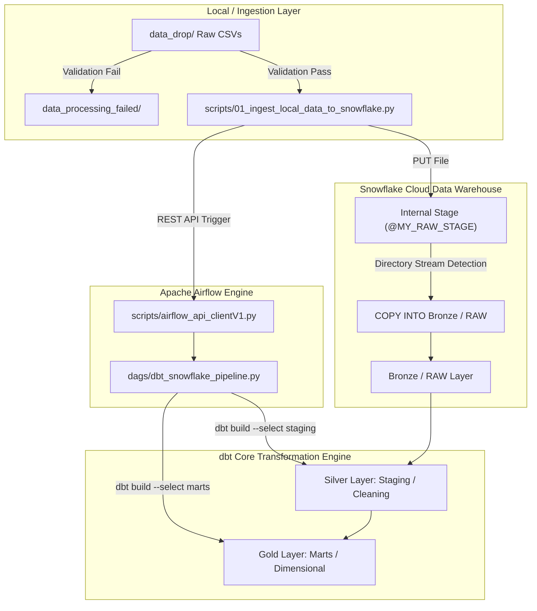

# End-to-End Automated Data Ingestion & Transformation Pipeline (Snowflake + Airflow + dbt)

This project demonstrates an automated Medallion Architecture data pipeline that ingests raw healthcare CSV datasets, validates schema integrity, stages data to Snowflake, checks for state changes via Snowflake Directory Streams, and triggers an Airflow DAG to perform dbt modeling and testing.

---

## 🏗️ Architecture Overview



## 🏗️ Architecture Overview

1. **Local File Validation & Staging (`validate_stage_files.py`)**:
   * Scans a local drop directory (`data_drop`) for inbound raw CSV files.
   * Performs schema, non-empty, and file name pattern validations.
   * Routes invalid files to `data_processing_failed/`.
   * Uploads valid files directly to a Snowflake Internal Stage (`@MY_RAW_STAGE`) via `PUT`.

2. **Event-Driven Orchestration Trigger (`check_snowflake_stream.py`)**:
   * Refreshes the Snowflake stage directory and evaluates `SYSTEM$STREAM_HAS_DATA` on a Directory Stream.
   * Executes a `COPY INTO` operation to load stage data into Bronze (`RAW`) tables.
   * Verifies Airflow cluster health via Airflow REST API.
   * Authenticates and dynamically triggers the downstream Airflow DAG (`02_snowflake_dbt_pipeline`).

3. **Orchestration & Transformation (`02_snowflake_dbt_pipeline.py` & dbt)**:
   * Airflow DAG runs `dbt debug` connection checks.
   * Executes `dbt build --select staging` (Silver Layer: Cleaning, Type Casting, Deduplication).
   * Executes `dbt build --select marts` (Gold Layer: Dimensional & Fact Modeling).

---

## 📂 Project Structure

```text
├── config/
├── dags/                             # Airflow DAGs folder
│   ├── dbt_snowflake_pipeline.py     # Primary Airflow DAG orchestration script
│   ├── hello_world_dag.py            # Test DAG
│   └── dbt_project/                  # dbt Project root
│       ├── macros/
│       ├── models/
│       │   ├── raw/
│       │   ├── staging/              # Silver layer dbt models
│       │   └── marts/                # Gold layer dbt models
│       ├── dbt_project.yml           # dbt project configuration
│       └── profiles.yml              # dbt connection target profile
├── data_drop/                        # Landing folder for incoming raw CSVs
├── data_processing_failed/           # Quarantine folder for malformed files
├── scripts/                          # Ingestion & orchestration utilities
│   ├── 01_ingest_local_data_to_snowflake.py
│   ├── airflow_api_clientV1.py
│   ├── airflow_health_check.py
│   ├── snowflake_config.py
│   └── snowflake_pipeline_runner.py
├── sql/                              # SQL scripts & setup DDLs
├── .env                              # Environment configuration
├── .gitignore
├── docker-compose.yaml               # Airflow local setup definition
├── Dockerfile
├── README.md
└── requirements.txt                  # Dependencies list
```
